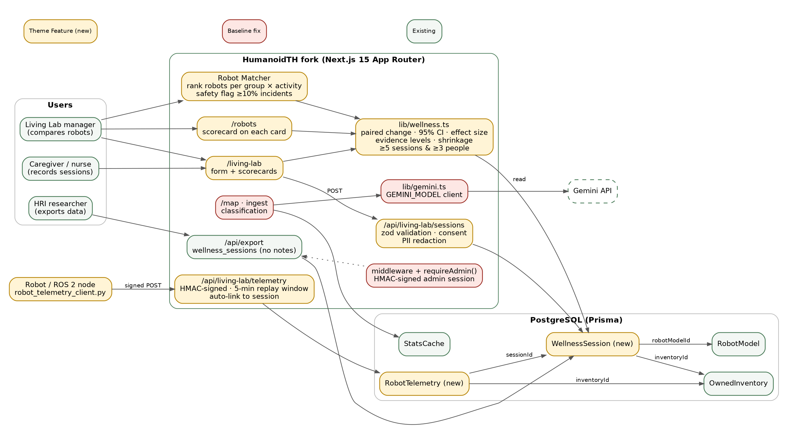

# HRI Hackathon Thailand 2026 — แผนของทีม

**Theme Feature:** HRI Wellness Living Lab — บันทึก Session การใช้หุ่นยนต์กับคนจริง, Robot Wellness Scorecard พร้อมระดับหลักฐานทางสถิติ, Robot Matcher และ Robot Telemetry (Physical AI)

## Deliverable 1 — Baseline Completion
ปิด 8 Gap ใน [BASELINE_AUDIT.md](./BASELINE_AUDIT.md)

## Deliverable 2 — Theme Feature (Integrate ใน Fork นี้)
| ส่วน | Integrate กับ HumanoidTH ตรงไหน | ระดับ |
| --- | --- | --- |
| Session Logger | Prisma `WellnessSession` → `RobotModel`, `OwnedInventory`; `POST/GET /api/living-lab/sessions`; route `/living-lab` | ต้องทำ |
| Robot Wellness Scorecard | CI 95%, effect size, ระดับหลักฐาน; แสดงบน `/living-lab` และการ์ดใน `/robots` | ต้องทำ |
| Robot Matcher | จัดอันดับหุ่นตามกลุ่มผู้ใช้ × กิจกรรม ด้วย empirical-Bayes shrinkage + safety flag | ต้องทำ |
| Robot Telemetry | `POST /api/living-lab/telemetry` ลงลายเซ็น HMAC, Python client สำหรับหุ่น/ROS 2 | ทำต่อถ้ามีเวลา |

วิธีเก็บและวิเคราะห์ข้อมูลกำหนดไว้ล่วงหน้าใน [LIVING_LAB_PROTOCOL.md](./LIVING_LAB_PROTOCOL.md)

## แผนวันที่ 3 ตุลาคม 2569
| เวลา | งาน | Output |
| --- | --- | --- |
| 08:30–09:30 | Sync upstream, ทุกเครื่องรันได้, ล็อก scope กับ Mentor | Issues 1 ใบต่อ 1 งาน |
| 09:30–12:00 | Baseline Gap 1–8 / คู่ขนาน: schema + ฟอร์ม | `check:no-mock-data` ผ่าน, merge รอบแรก |
| 13:00–15:30 | API, `/living-lab`, Scorecard, Robot Matcher | Flow end-to-end |
| 15:30–17:00 | Test, deploy, CHANGELOG | ล็อกเวอร์ชัน Demo |
| 17:00– | Telemetry (ถ้าเข้าถึงหุ่นได้), เก็บ Session จริง, ซ้อม Pitch | วิดีโอสำรอง |

## วิธีทำงานบน Fork
- `main` = พร้อม Demo เสมอ; งานแยก branch (`fix/...`, `feat/...`) → PR → merge ทุก 1–2 ชม. หลัง build + test ผ่าน
- Conventional Commits, 1 Gap ต่อ 1 commit
- `git fetch upstream` ตอนเริ่มวันและก่อนล็อก Demo
